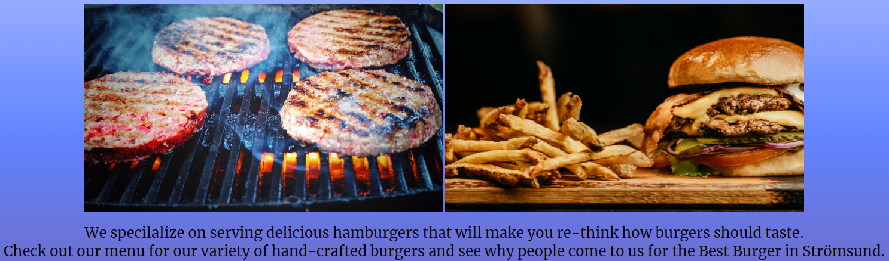

# Hamburger Palace
(Developer: Simon Samuelsson)


[Live webpage](https://simonericalexius.github.io/CI_PP1_HP/)

## Table of Content

1. [Project Goals](#project-goals)
    1. [User Goals](#user-goals)
    2. [Site Owner Goals](#site-owner-goals)
2. [User Experience](#user-experience)
    1. [Target Audience](#target-audience)
    2. [User Requirements and Expectations](#user-requirements-and-expectations)
    3. [User Stories](#user-stories)
3. [Design](#design)
    1. [Design Choices](#design-choices)
    2. [Colours](#colours)
    3. [Fonts](#fonts)
    4. [Structure](#structure)
    5. [Wireframes](#wireframes)
4. [Technologies Used](#technologies-used)
    1. [Languages](#languages)
    2. [Frameworks & Tools](#frameworks-and-tools)
5. [Features](#features)
6. [Testing](#testing)
    1. [HTML Validation](#HTML-validation)
    2. [CSS Validation](#CSS-validation)
    3. [Accessibility](#accessibility)
    4. [Performance](#performance)
    5. [Device Testing](#device-testing)
    6. [Browser Compatibility](#browser-compatibility)
    7. [Testing User Stories](#testing-user-stories)
8. [Bugs](#Bugs)
9. [Deployment](#deployment)
10. [Credits](#credits)
11. [Acknowledgements](#acknowledgements)

## Project Goals

### User Goals
- Find a great hamburger restaurant
- Find opening hours to know when they can come and buy food
- Find adress to location of the restaurant
- Be able to see what is on the menu
- Find a way to contact the restaurant

### Site Owner Goals
- Give potential customers a way to find the restaurant
- To increase the restaurant revenue
- Give users a menu with what hamburgers they can buy
- Give users a way of contacting the restaurant
- Give users a history and goal of the restaurant

## User Experience

### Target Audience
- Users that are looking for a good meal
- Users that want to get in touch with the restaurant
- Users that want to know when the restaurant is open
- Users that want to know more about the restaurant

### User Requirements and Expectations
- Easy navigation on the website
- Easy to find what is on the menu
- Easy and multiple ways to contact the restaurant

### User Stories
#### First Time Users
- What time is the restaurant open
- Where is the restaurant located
- What is on the menu
- What do other people say about the restaurant

#### Returning Users
- How to contact the restaurant with feedback
- What is the restaurants history and future goals
- Can I find the restaurant on social media

## Design

### Design Choices
The design was made to easy understand what the website is about and for easy navigation without difficulty for users to find what they are looking for.

### Colours
The background colour was chosen as a good fit for the yellow and brown colours in hamburgers and fries. The logo colour was chosen orange as it is the main colour in the restaurant.

### Fonts
The logo, navigation bar and the headings have the font of Economica, whilst the body have the font of Merriweather.

### Structure
The website was made to easy navigate around the five pages of the website with the logo to take you back to the home page if the users wish. They will find a menu, information about the restaurant, a gallery and a way to contact the restaruanat.

## Wireframes
<details><summary>Home</summary></details>
<details><summary>Menu</summary></details>
<details><summary>About</summary></details>
<details><summary>Gallery</summary></details>
<details><summary>Contact</summary></details>

## Technologies Used

### Languages
- HTML
- CSS

### Frameworks and Tools

- Git
- Github
- Gitpod
- cssgradient.io
- Font Awesome
- favicon.io
- Balsamiq
- Google Fonts
- Google Maps
- bit.ly
- Eye Dropper

## Features

### Logo and Navigaton Bar
- Logo and navigation are the same on all pages
- Logo also works as a link to the home page
- The navigation bar consist of Home, Menu, About, Gallery and Contact
- When you hover the navigation, the colour changes and when the page is active the same colour stays


### First Glance Information
- One image with hamburger patties on the grill
- One image with a ready to eat hamburger and fries
- Short text with information about the restaurants hamburgers and why people come there to eat



### Opening Hours
- Shows at what times the restaurant is open monday to friday, saturday and sunday


### User Feedback
- Shows what previous customers have to say about the restaurant
- Shows the customer name and where they are from


### Footer
- The footer contains of six social media links, Facebook, Instagram, Twitter, Youtube, Tiktok and Pinterest


### Menu
- The menu have images of the restaurants burgers
- Information about what is on the burgers


### About
- The about us page have two images, one with the food truck before the restaurant opened and one image in the kitchen after the restaurant opened
- Information about why they started their business, where they are today and what their future goals are
- One video where they make a burger in the restaurant kitchen


### Gallery
- The gallery contains of 17 images with various hamburgers and staff members


### Contact Form
- The contact form contains of two text entries, name and message
- The contact form contains of one email entrie
- The contact form conatins of one dropdown menu to choose topic of message
- All entries need to be filled or user won't be able to send their message


### Adress and Phone Number
- Just below the contact form on the contact page, the adress for the restaurant can be found
- A phone number to the restaurant is listed under the adress
- To easier find where the restaurant is located a google map is embeded


## Testing

### HTML Validation
[W3C Markup Validation Service](https://validator.w3.org/) is used for HTML validation

<details><summary>Home</summary></details>
<details><summary>Menu</summary></details>
<details><summary>About</summary></details>
<details><summary>Gallery</summary></details>
<details><summary>Contact</summary></details>

### CSS Validation
[W3C CSS Validation Service](https://jigsaw.w3.org/css-validator/) is used for CSS validation

<details><summary>CSS</summary></details>

### Accessibility
[WAVE Web Accessibility Evaluation Tools](https://wave.webaim.org/) is used for accessibility testing

<details><summary>Home</summary></details>
<details><summary>Menu</summary></details>
<details><summary>About</summary></details>
<details><summary>Gallery</summary></details>
<details><summary>Contact</summary></details>

### Performance
[Lighthouse](https://developer.chrome.com/docs/lighthouse/overview/#devtools) was used in Chrome DevTools for performance testing

<details><summary>Home</summary></details>
<details><summary>Menu</summary></details>
<details><summary>About</summary></details>
<details><summary>Gallery</summary></details>
<details><summary>Contact</summary></details>

### Device Testing
The website has been tested on these devices
- Sony Xperia 1 III
- Apple iPad 7th Generation
- iPhone SE 2nd Generation
- Samsung Galaxy S20 Ultra
- Samsung Galaxy Note 9
- Asus ROG Phone 2

### Browser Compatibility
The website has been tested in these browser
- Google Chrome
- Microsoft Edge
- Firefox
- Opera
- Brave

### Testing User Stories
#### First Time Users
- What time is the restaurant open
    1. Go to home page
    2. Scroll down
<details><summary>Screenshot</summary></details>

- Where is the restaurant located
    1. Go to contact
    2. Scroll down
<details><summary>Screenshot</summary></details>

- What is on the menu
    1. Go to menu
<details><summary>Screenshot</summary></details>

- What do other people say about the restaurant
    1. Go to home page
    2. Scroll down
<details><summary>Screenshot</summary></details>

#### Returning Users
- How to contact the restaurant with feedback
    1. Go to contact
<details><summary>Screenshot</summary></details>

- What is the restaurants history and future goals
    1. Go to about
<details><summary>Screenshot</summary></details>

- Can I find the restaurant on social media
    1. Go to any of the navigation pages
    2. Scroll down to bottom
<details><summary>Screenshot</summary></details>

## Bugs
 - The text next to some of the hamburger images on the menu doesn't line up as intent on some devices
 <details><summary>Screenshot</summary></details>

### Fixed bug
[Commit](https://github.com/SimonEricAlexius/Project-Portfolio-1.1/commit/e1cd9da7da3c7949d5693d90906d5024baf8da28)
```
width: 280px;
height: 280px;
padding: 10px 45px;
float: left;
```
<details><summary>Screenshot</summary></details>

## Deployment
- The website was deployed using GitHub pages by doing
    1. From GitHub repository go to the settings tab
    2. Locate the Pages tab in the navigation side bar on the left
    3. Below Branch there is a dropdown menu, click and choose main
    4. Click on save

The live link https://simonericalexius.github.io/CI_PP1_HP/

## Credits
### Media
- Every image used on the website is from [pexels.com](https://www.pexels.com/), picked among the free stock photos
- YouTube video on about page is borrowed from the YouTube channel [Certified Angus Beef brand Test Kitchen](https://www.youtube.com/@CertifiedAngusBeefLL)

### Code
- The gradient background was taken at [cssgradient.io](https://cssgradient.io/gradient-backgrounds/)
- The gallery is from [Code Institute](https://codeinstitute.net/se/) [Love Running project](https://github.com/SimonEricAlexius/love-running/blob/main/gallery.html)

## Acknowledgements
- The book [HTML & CSS: Design and Build Websites](https://www.goodreads.com/book/show/10361330-html-and-css) by [Jon Duckett](https://www.goodreads.com/author/show/135171.Jon_Duckett) was helpful sometimes, it also inspired the home page design (page 323)
- Just as the previous mentioned book was helpful sometimes, the website [w3schools.com](https://www.w3schools.com/) was a great asset, especially for me to understand margins and paddings a bit better
- The guy over on Tutor Assistance at Code Institute that helped me with what to put as action in the contact form, I was trying to figure it out for days
- My family who kept pushing that I can make this happen, since I have bad anxiety and zero self esteem
- The GitHub user 4n4ru and her perfectly made [readme.md](https://github.com/4n4ru/CI_MS1_BodelschwingherHof/blob/master/README.md) file, whithout it as a template I don't think I would've been able to put a readme.md file together
- Also not to forget my mentor Mo Shami that got me to actually start working on the project and helped me on the way